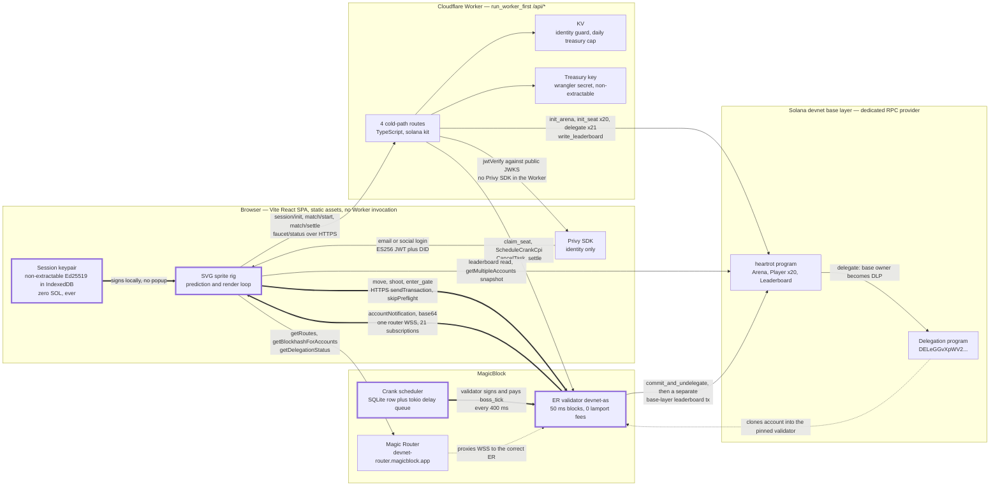
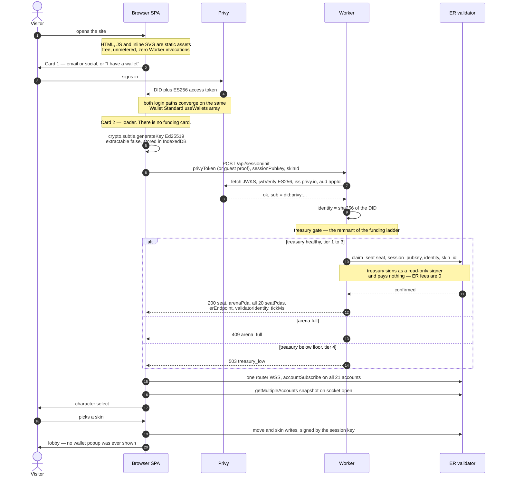
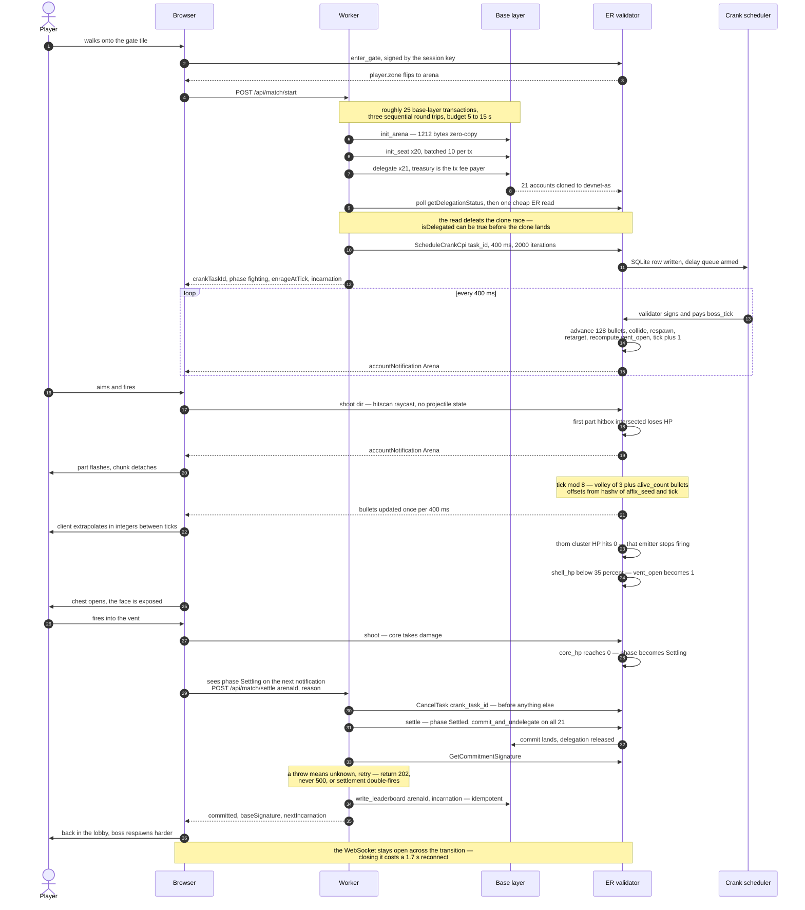
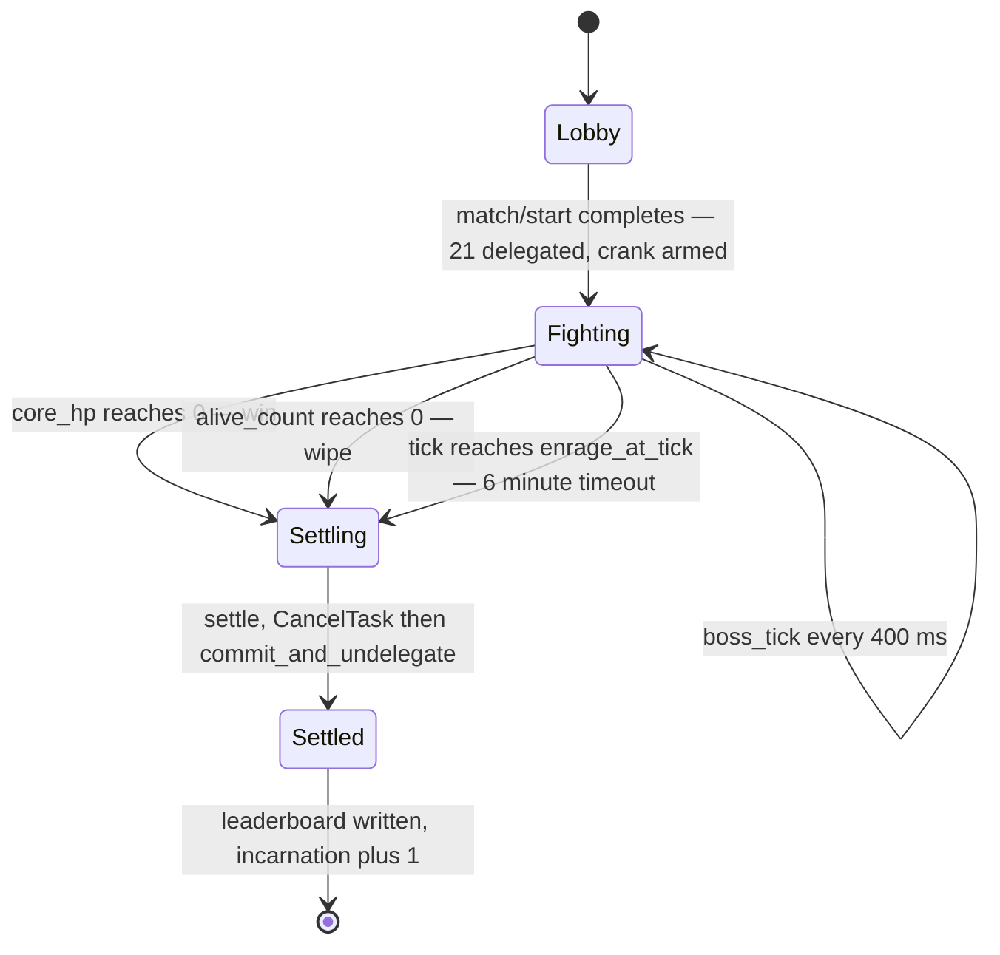
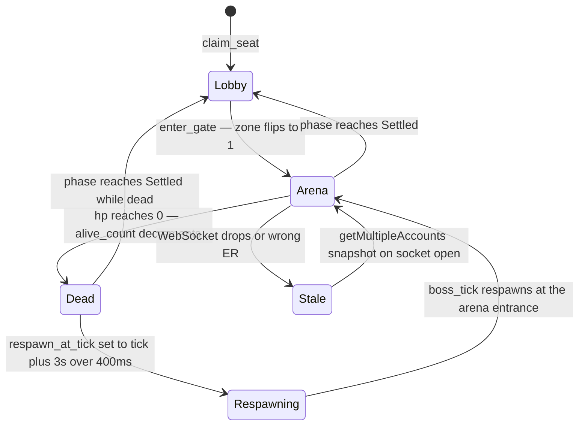
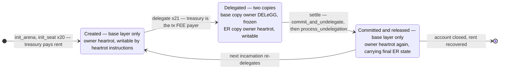

# HEARTROT — Architecture Diagrams

**Date:** 2026-09-01
**Status:** Visual companion to `01-architecture.md`
**Target:** Solana devnet

Six diagrams. Each is followed by what it shows and the single thing a reader would
otherwise get wrong.

> These draw the **post-decision** architecture from `01-architecture.md`: one plain Anchor
> program (`heartrot`), zero BOLT, zero Pinocchio, 21 delegated accounts, a Vite SPA on
> Cloudflare static assets, no funding ladder, and settlement as two ordinary transactions
> rather than a Magic Action. Where `00-game-design-spec.md` still says otherwise, the spec
> is stale — see `01-architecture.md` §0 and §12.

---

## 1. System context

**What it shows.** Every arrow the system has and which of four surfaces it crosses. Thick
arrows are the hot path — session key signs in the browser, transaction goes straight to
the ER validator, state returns over one WebSocket, and the crank writes the same accounts
in parallel. Thin arrows are the cold path: four HTTPS calls to the Worker, all setup or
teardown, none of them in a frame. `run_worker_first: ["/api/*"]` is what makes that
separation structural rather than a convention — nothing but `/api/*` can reach the Worker.

**What a reader gets wrong.** That "MagicBlock" is one endpoint. It is three RPC surfaces
and they are not interchangeable. `getLatestBlockhash` on the router returns an **ER**
blockhash, so using the router as a drop-in connection for a base-layer delegate or
funding transaction signs against the wrong chain and fails. Worse, reading a delegated
account from the **wrong ER region** returns a correctly-owned account with silently stale
data — no error, and an `accountSubscribe` there delivers zero notifications while staying
open. The boss simply freezes for that player and it reads as a game bug. That is why
`Arena` carries a `validator_identity` field and `/api/session/init` returns `erEndpoint`
as mandatory routing data, not convenience. Fourth surface worth naming: the base-layer RPC
must be a **paid provider** — `api.devnet.solana.com` returns HTTP 403 to Worker egress
while the identical POST from a shell returns 200.

---

## 2. Cold visitor to lobby

**What it shows.** Stranger to walking character in two cards. The session keypair is
generated, never funded, and never leaves the browser; the Worker only ever learns its
public key. The only transaction a player signs in this whole flow is signed locally by a
key that holds zero lamports.

**What a reader gets wrong.** That the funding tier cascade lives here. It is **deleted**.
ER transaction fees are 0 lamports and the ER's forked SVM performs no fee-payer validation
at all — a freshly random, never-existent pubkey was accepted as fee payer in a live probe
and its transaction executed. Since the Worker signs every base-layer transaction, the
session wallet needs zero SOL on both layers, so the four tiers, the browser-side airdrop,
and onboarding card 2 all solve a cost that does not exist. What survives is the
**treasury** gate drawn above: the `alt` block is a health check on the platform wallet,
not on the player. Second trap in the same diagram: a returning user with cleared IndexedDB
must get their seat back — `/api/session/init` is idempotent on `identity` and overwrites
`session_pubkey`, because IndexedDB is evictable and Privy identity is the only durable
record.

---

## 3. Gate to settlement

**What it shows.** The full match. The crank loop, the player's shot and the boss volley are
three independent writers hitting the same ER accounts at 50 ms block time, and the boss is
never a health bar — parts come off, the vent opens as a consequence of `shell_hp`, and only
then is the core damageable.

**What a reader gets wrong.** That "the crank ticks forever, so the game never stops."
Three things break that. First, the crank's **account list is frozen at schedule time** —
it can never see an account it was not handed, which is why all 20 `Player` PDAs are
seat-indexed and created *before* `ScheduleCrankCpi`, and why lazy join is structurally
impossible. Second, ten consecutive execution failures move the task to `failed_tasks`
permanently after roughly 26.3 s of backoff, and there is no RPC to ask whether your task
is alive — hence `boss_tick` must never return `Err`, and the client watchdog on
`arena.tick` is mandatory at two thresholds, 3 s soft and 30 s hard. Third, `CancelTask`
must run **before** undelegation or the crank fires into released accounts. Also note what
is *not* here: settlement is **two ordinary transactions**, not a Magic Action. A failing
post-commit action can be removed from the transaction strategy and the commit retried
without it, so the leaderboard write must be independently idempotent anyway — and once it
is, the Magic Action buys nothing but a delegated fee-payer PDA, a fee vault, and an
undocumented `as_signer` workaround.

---

## 4. Data and instruction map

The ECS decomposition from spec §5 survives as **struct fields on two accounts**, not as
entities, components and systems. This is the same map, drawn against what actually ships.

```mermaid
flowchart TB
    subgraph ACC["Accounts — PDAs of heartrot, 21 delegated per match"]
        direction TB
        subgraph AR["Arena — zero_copy, 1212 bytes, 1 account"]
            A1["phase, tick, incarnation<br/>alive_count, enrage_at_tick"]
            A2["arena_id, crank_task_id<br/>crank_authority, validator_identity"]
            A3["affix_seed 32 bytes<br/>seat_occupied bitmask"]
            A4["Boss — x, y, parts x9, parts_max x9<br/>core_hp, vent_open, attack_timer, target_seat"]
            A5["Bullets — 128 x 8 bytes<br/>x, y, dx, dy, active"]
        end
        subgraph PL["Player — zero_copy, 104 bytes, 20 accounts"]
            P1["seat, zone, facing, skin_id"]
            P2["x, y, hp, hp_max"]
            P3["respawn_at_tick, last_shot_tick, last_move_seq"]
            P4["damage_dealt, session_pubkey, identity"]
        end
        subgraph LB["Leaderboard — borsh, base layer, never delegated"]
            L1["entries — identity, incarnation,<br/>arena_id, damage_dealt, survived"]
        end
    end

    subgraph IX["Instructions"]
        direction TB
        I1["init_arena, init_seat — base, treasury"]
        I2["delegate_arena, delegate_seat — base, treasury"]
        I3["claim_seat — ER, treasury"]
        I4["move seq, dx, dy — ER, session key"]
        I5["shoot dir — ER, session key"]
        I6["enter_gate — ER, session key"]
        I7["boss_tick — ER, crank signer PDA only"]
        I8["settle — ER, treasury"]
        I9["write_leaderboard — base, treasury"]
    end

    I1 -->|"allocates"| AR
    I1 -->|"allocates"| PL
    I2 -.->|"changes base-layer owner"| AR
    I2 -.->|"changes base-layer owner"| PL
    I3 -->|"writes session_pubkey, identity, skin_id"| PL
    I4 -->|"writes x, y, facing, last_move_seq"| PL
    I5 -->|"writes Boss parts and core_hp"| AR
    I5 -->|"writes last_shot_tick, damage_dealt"| PL
    I6 -->|"writes zone"| PL
    I6 -->|"reads phase, alive_count"| AR
    I7 -->|"writes bullets, tick, vent_open, phase"| AR
    I7 -->|"writes hp, respawn_at_tick for all 20"| PL
    I8 -->|"writes phase, commits"| AR
    I8 -->|"commits"| PL
    I9 -->|"appends one entry per player"| LB

    I4 -.->|"authority equals session_pubkey"| P4
    I5 -.->|"authority equals session_pubkey"| P4
    I6 -.->|"authority equals session_pubkey"| P4
    I7 -.->|"authority equals crank-executor PDA"| A2
```

**What it shows.** Every writer of every field, and the two distinct authority checks — the
dotted edges. Player-facing instructions assert `signer == player.session_pubkey`;
`boss_tick` asserts against `find_program_address(["crank-executor", crank_authority])`
under the Crank program and can never assert against a player key, because that PDA is the
only signer a scheduled instruction may carry.

**What a reader gets wrong.** That the ECS shape was lost. It was not — `Position`,
`Health`, `Combat` and `PlayerMeta` are the four field groups inside `Player`, and
`ArenaState`, `Bullets`, `Parts` and `Core` are field groups inside `Arena`. What changed is
that they are **fields, not accounts**, which is what deletes the constraint that killed the
BOLT design: components returned through the return-data buffer are capped at 1,024 bytes
and `Bullets[128]` alone serialized to 936 of them, so the spec's single `BossTick` was
about 4x over the ceiling and could not be tuned to fit. As a `#[account(zero_copy)]` field
the same 1 KB bullet pool is mutated in place with no serialization at all. The second thing
to notice: `shoot` writes `Arena` **and** `Player`, and so does `boss_tick` — 21 writable
accounts in one transaction is why every account in a match must be delegated to one
validator identity. A mixed-validator transaction is unbuildable, not merely slow.

---

## 5. State machines

Arena phase — the `u8` on `Arena`, authoritative for what all 20 clients render:

One player:

**What they show.** Arena phase is global and lives on chain; player state is per-account
and moves independently of it. The only transition the crank cannot make is
`Lobby -> Fighting`, because arming the crank is itself the transition.

**What a reader gets wrong.** Two things. First, `Rolling` is gone — v1 derives incarnation
affixes synchronously from `hashv([arena_key, incarnation])` and wires the `affix_seed`
field for a v1.1 VRF swap. That is not laziness: a crank **cannot request VRF** because the
validator rejects any scheduled instruction carrying a writable signer and the VRF request
needs `payer` as one, so a VRF roll would have to ride on the killing-blow player
transaction, and a panicking callback retries for two minutes while the incarnation never
rolls. There is no token and no economy, so predicting a co-op PvE boss's affixes wins
nothing. Second, `Stale` is not a client-only concern. A dropped socket costs a measured
**1.7 s** of blind gameplay — four missed ticks, in a bullet-hell fight — and subscribing
does **not** deliver current state: notifications fire only on the next write, so a player
standing still after a reconnect sees a frozen world indefinitely. The
`getMultipleAccounts` snapshot on every WebSocket `open` is mandatory, not an optimization,
and it is the same mechanism that recovers from a wrong-ER subscription.

---

## 6. Account ownership through delegation

Who may write what, at each stage:

| Stage | Base-layer owner | Writable on base by | Present in ER | Writable in ER by |
|---|---|---|---|---|
| Created | `heartrot` | `heartrot` instructions, treasury-signed | no | — |
| Delegated | Delegation program | nobody | yes, owner `heartrot` | session keys, treasury, crank signer PDA |
| Released | `heartrot` | `heartrot` instructions | no | — |

`Leaderboard` never enters this diagram. It is base-layer only for the life of the project,
which is exactly why the leaderboard write is a separate transaction after the commit
confirms.

**What it shows.** Delegation moves the **write surface**, not the account. The base account
stays where it is; the Delegation program takes ownership so nothing on L1 can touch it,
and a live copy inside the ER keeps the original owner and takes every write. Ownership
therefore differs by layer for the same account at the same moment — do not hand-roll an
owner check, let Anchor's `seeds`/`bump` constraint handle it.

**What a reader gets wrong.** That the treasury just needs to be *a* signer on the delegate
instruction. The delegate instruction marks `payer` **non-writable** — it only works because
the transaction fee payer is always writable at message level, so the treasury must be the
transaction **fee payer**, not merely a passed-in `payer` key. A treasury paying fees while
a different key is named as `payer` fails. Two more that bite at this boundary: pass
`commit_frequency_ms` explicitly as `u32::MAX` rather than accepting a default, because
`0` may mean "as often as possible" and would burn the 10-commit free allowance across 21
accounts in seconds and then fail with `0xA0000000`; and delegation must **span
incarnations** — the 300,000-lamport session charge is per account per session, so
re-delegating on each boss respawn costs another 0.0063 SOL every time instead of once per
match.

---

## Where these diagrams still disagree with `00-game-design-spec.md`

Each is argued in `01-architecture.md`; listed here only so a reader of the diagrams alone
is not misled.

- **BOLT is deprecated** as of 2026-05-28 and `bolt-lang 0.2.4` does not compile from
  crates.io. Diagrams 1, 4 and 6 draw one Anchor program, not a World plus 16 component and
  system programs. 21 delegated accounts, not 86.
- **No Pinocchio program exists in v1.** With one program owning every account there is no
  ownership boundary to cross, and a CPI hop costs more CU than the framework saves.
- **The funding ladder in diagram 2 is deleted.** ER fees are zero and the ER performs no
  fee-payer validation.
- **Settlement in diagram 3 is two transactions, not a Magic Action.**
- **Diagram 1's `validator_identity`** and **diagram 4's `last_move_seq`** are fields the
  spec's component list does not have and both are load-bearing — the first prevents the
  silent wrong-ER freeze, the second makes client prediction reconcilable at all.
- The spec's "10 ms ER latency" is block time, not round trip. Measured move-to-confirm
  from India is 136–196 ms, so build-order step 2's "it feels instant" gate needs
  client-side prediction, not a faster chain.
